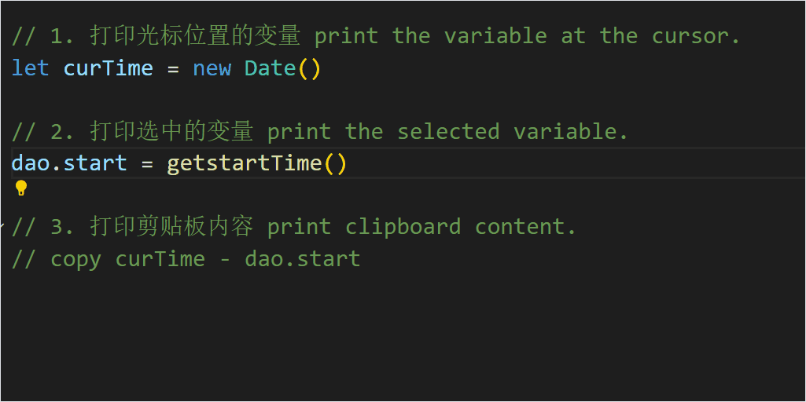

# QuickPrint

快速打印光标位置的变量、选中的变量、或剪贴板内容，支持多种编程语言的可定制格式。  
quickly print the variable at the cursor, the selected variable, or the clipboard content in customizable formats across multiple programming languages.  

## Features



## Commands & keybindings

- **Commands**
```json
// 提示: 使用 Ctrl+Shift+P 打开命令面板然后输入命令
// Tip: Use Ctrl+Shift+P to open the Command Palette and type the command
{
  // 快速打印: 打印光标所在单词或选中文本
  "command": "quickprint.printWordOrSelectedText",
  "title": "quickprint: Print Word At Cursor Or Selected Text"
}
{
  // 快速打印: 打印剪贴板内容
  "command": "quickprint.printClipboardContent", 
  "title": "quickprint: Print Clipboard Content"
},
```

- **default keybindings**

```json
// 提示: ctrl+k ctrl+s 可以打开快捷键设置面板或者可以在keybindings.json直接更改
// Tip: Press Ctrl+K Ctrl+S to open the Keyboard Shortcuts panel, or edit directly in the keybindings.json file.
{
  "key": "alt+shift+w",
  "command": "quickprint.printWordOrSelectedText",
  "when": "editorTextFocus"
},
{
  "key": "alt+shift+p",
  "command": "quickprint.printClipboardContent",
  "when": "editorTextFocus"
}
```


## Settings

- **`quickprint.outputFormat`**:  
用于配置不同语言的打印格式和位置（`below` 或 `above`），其中占位符`_var_`会被替换为变量名。  
Used to configure the print format and position (below or above) for different languages, where the placeholder `_var_` will be replaced with the variable name.  

- **`quickprint.restoreCursorAfterInsert`**:  
插入文本后是否恢复光标到原来位置  
Whether to restore the cursor position after inserting text.  

- **For example**:  

  ```json
  // in settings.json
  "quickprint.restoreCursorAfterInsert":true,
  "quickprint.outputFormat": {
    // default:
    "go": { "position": "below", "format": "fmt.Println(\"_var_:\", _var_)" },
    "java": { "position": "below", "format": "System.out.println(\"_var_: \" + _val_)" },
    "python": { "position": "below", "format": "print('_var_:', _var_)" },
    "javascript": { "position": "below", "format": "console.log('_var_:', _var_)" },
    // ...
    // Add custom language configuration, for example:
    "haskell": { "position": "below", "format": "putStrLn (\"_var_: \" ++ show _var_)" }
  }
  ```

## With vscodeVim

```json
// in Settings.json
"vim.normalModeKeyBindingsNonRecursive": [
  { 
  "before": ["<space>", "p", "w"], 
  "commands": ["quickprint.printWordOrSelectedText"] 
  },
  { 
  "before": ["<space>", "p", "c"], 
  "commands": ["quickprint.printClipboardContent"] 
  },
],
"vim.visualModeKeyBindingsNonRecursive": [
  { 
  "before": ["<space>", "p", "w"], 
  "commands": ["quickprint.printWordOrSelectedText", "extension.vim_escape"] 
  },
]
```

## Issues and Feedback
遇到问题或有建议，直接在 [GitHub repository](https://github.com/wuqzh8/vscode-quickprint/issues) 提交issue。  
If you encounter any issues or have suggestions, open an issue on [GitHub repository](https://github.com/wuqzh8/vscode-quickprint/issues).  

**Enjoy!**